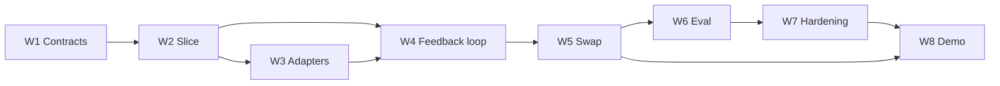

2026-06-16-primer-core-jira-epics-and-tickets.md
# primer-core — Jira Epics & Tickets (3 participants × 8 weeks)
 
**Date:** 2026-06-16
**Status:** Ticket-ready specs (NOT yet created in Jira — import/create manually or via API when ready)
**Source of truth:** the 8 weekly plans + `2026-06-16-primer-core-INDEX-and-api-contract.md` in this folder. Every story links to its week's plan; **implementers must apply the INDEX's frozen API contract + per-plan override cheatsheet.**
 
---
 
## Participants → tracks → components
 
| Participant | Epic | Hackathon track | Owns (engine components) |
|---|---|---|---|
| **Malakhi** | Learning Data (`EPIC-LD`) | Track 1 — Student Model | `DomainSchema`, `MemoryCore` (write/ingest/assemble), `MemoryStorePort` + in-memory/file stores, **Eval & parity harness** |
| **Rianna** | Knowledge Graph (`EPIC-KG`) | Track 3 — Learner-Teaching | `KnowledgeBasePort`, KG ingest, retrieval (`PgVectorKnowledgeBase`), **DomainPacks** (manifests + per-domain WDF + KB wiring), the domain-swap data side |
| **Joseph** | Didactic Skills (`EPIC-DS`) | Track 2 — Learning Actions | `SkillRegistry`, `EngagementOrchestrator`, hooks/triggers, write-back, **`InteractionAgent`**, AG-UI streaming |
 
> **Framing:** these are independent build challenges around the shared `primer-core` framework. The Week-3 "Capillary adapter" is a *reference adapter* against the platform's pgvector KB + `workflow-cli` — not a platform extension.
 
## Conventions (for import)
 
- **Issue types:** Epic → Story (one per participant per week).
- **Placeholder keys:** `EPIC-LD/KG/DS` and `LD-W#`, `KG-W#`, `DS-W#`. Replace with real keys (project `RAG` or a dedicated Primer project) on creation.
- **Labels:** `primer-core`, `<participant>`, `week-#`, plus `gate` on integration-gate stories.
- **Story points (Fibonacci):** lead-the-week ≈ 5–8; contribute/support ≈ 2–3.
- **Components (Jira):** `learning-data`, `knowledge-graph`, `didactic-skills`.
- **Sprints:** 1 week each (W1…W8), aligned to the weekly check-in.
## Integration-gate ownership (the demoable end of each week)
 
| Wk | Gate | Lead | Depends on |
|---|---|---|---|
| 1 | Contracts frozen; education manifest validates | Malakhi | — |
| 2 | Education engagement runs in-memory | Joseph | Malakhi (MemoryCore), Rianna (FakeKB) |
| 3 | Same engagement on Capillary adapters | Joseph | Rianna (PgVector), Malakhi (FileStore) |
| 4 | Adaptive engagement; memory persists across sessions | Joseph | Malakhi (persistence) |
| 5 | Finance engagement on the SAME engine (swap) | Rianna | Joseph (finance engagements), Malakhi (finance dims) |
| 6 | Diff between domains = manifest + KB only | Malakhi | Rianna (retrieval fixtures), Joseph (determinism/AG-UI) |
| 7 | Green suite + docs; stretch graph adapter | (all) | — |
| 8 | Combined dual-domain demo + handoff | Joseph | all |
 

 
---
 
# EPIC-LD — Malakhi · Learning Data
 
**Goal:** Own the swappable data spine: the `DomainSchema` manifest, the `MemoryCore` write/ingest/assemble pipeline, the storage ports + adapters, and the Week-6 eval/parity harness that proves the domain swap.
**Labels:** `primer-core`, `malakhi`, `learning-data`
**Plans:** week1, week2, week6, week7 (+ contributes week3/4/5/8).
 
### LD-W1 — Freeze contracts: DomainSchema + storage ports (5 pts, `gate`)
**Plan:** week1-contracts-skeleton. **Depends on:** —
Author in the SDK: `DomainSchema`/`DimensionSpec`/`KnowledgeBaseWiring` (10/10/10 validation), `load()`, `validate_memory_entry()`, `MemoryStorePort`, `InMemoryMemoryStore`. Co-freeze the cross-week API with Rianna (KnowledgeBasePort) and Joseph (runner/skill contract).
**AC:**
- `education.manifest.yaml` loads and validates; duplicate/over-limit dimensions rejected.
- `MemoryStorePort` + `InMemoryMemoryStore` pass the full SDK suite (no regressions to the existing 209 tests).
- Public exports wired; `ruff` clean.
### LD-W2 — MemoryCore write/ingest/assemble (5 pts)
**Plan:** week2 (Task 2/3). **Depends on:** LD-W1.
Implement `MemoryCore.write(subject_id, entry)` (validate→store), `ingest(subject_id, signal)` (signal→dimension→entry→write), `assemble_working_memory → WorkingMemoryAssembly`. **Apply the INDEX write/ingest flip.**
**AC:**
- `write` rejects undeclared dimension/field; `ingest` maps `payload['dimension']`/`content` then delegates to `write`.
- `assemble_working_memory` returns a `WorkingMemoryAssembly` with all stored entries for the subject.
- Unit tests green for both `write` (entry) and `ingest` (signal).
### LD-W3 — Persistent FileMemoryStore (3 pts)
**Plan:** week3 (FileMemoryStore task). **Depends on:** LD-W1, LD-W2.
JSON-file-backed `MemoryStorePort` (`FileMemoryStore(path=...)`) surviving process restart.
**AC:** round-trip store/get survives a new instance on the same path; same `dimension`/`tier` filters as in-memory; passes the shared port behavior.
 
### LD-W4 — Memory persistence in the feedback loop (3 pts)
**Plan:** week4 (write-back + mid-point gate). **Depends on:** LD-W3, DS-W4.
Ensure `write_back_outcome` (Joseph's hook) persists via `MemoryCore.ingest`, and prove cross-session recall over `FileMemoryStore`.
**AC:** two sessions over the same store path — session 2's `assemble_working_memory` (or `store.get`) surfaces session 1's written outcome.
 
### LD-W5 — Finance dimensions run unchanged (3 pts)
**Plan:** week5 (finance MemoryCore test). **Depends on:** LD-W2, KG-W5.
Confirm `MemoryCore` + `validate_memory_entry` accept the coop-finance dimensions (`financial_history`, `risk_appetite`, `goals`, `habits`) with **zero engine change**.
**AC:** a finance `risk_appetite` signal `ingest`s, validates, and is retrievable; no edits to `MemoryCore` source (git diff proves it).
 
### LD-W6 — Eval & parity harness (8 pts, `gate`)
**Plan:** week6. **Depends on:** LD-W5, KG-W6, DS-W6.
Build `eval/`: `run_swap_parity(domains) → list[SwapParityResult]`, `TransitionMetricsReport` (5 metrics), `precision_at_k`, determinism check. Implement `stateless_agents` by attribute-set inspection (no `has_in_process_state`). **Apply the INDEX Week-6 overrides.**
**AC:**
- `run_swap_parity(['education','coop-finance'])` shows identical engine-module set across domains.
- All 5 transition metrics pass; eval runnable via `-m eval` / `primer-eval`.
### LD-W7 — Memory hardening + shared conformance + stretch (5 pts)
**Plan:** week7. **Depends on:** LD-W6.
Extract the shared `MemoryStorePort` conformance suite (in-memory + file pass it); harden `MemoryCore` edge cases; **stretch:** `GraphitiMemoryStore` passing the same conformance suite.
**AC:** conformance suite green for all stores; coverage raised on `MemoryCore`; stretch clearly optional and, if attempted, green.
 
### LD-W8 — Learning Data demo + proposal section (3 pts)
**Plan:** week8. **Depends on:** LD-W6.
`demos/demo_education.py` memory path; author the schema/memory section of the architecture proposal mapped to transition metrics.
**AC:** demo runs and prints memory write/read; proposal section reviewed; contributes to dual-domain demo.
 
---
 
# EPIC-KG — Rianna · Knowledge Graph
 
**Goal:** Own the knowledge side: the retrieval port, KG ingest, the real pgvector KB adapter, and the `DomainPack` abstraction (manifests + per-domain WDF + KB wiring) that makes the education→finance swap real.
**Labels:** `primer-core`, `rianna`, `knowledge-graph`
**Plans:** week1, week3, week5 (lead), week7 (+ contributes week2/4/6/8).
 
### KG-W1 — Freeze KnowledgeBasePort + author manifests (3 pts, `gate`)
**Plan:** week1. **Depends on:** —
Define `KnowledgeBasePort.retrieve(query, kb_names, top_k)`; author both example manifests' `knowledge_base` wiring (education + coop-finance) with Malakhi's `DomainSchema`.
**AC:** both manifests load/validate; `KnowledgeBasePort` is abstract + exported; KB wiring fields agreed with Malakhi.
 
### KG-W2 — Education KB + FakeKnowledgeBase for the slice (3 pts)
**Plan:** week2 (KB side). **Depends on:** KG-W1.
Provide `FakeKnowledgeBase` (canned chunks) and the education KB wiring feeding Joseph's `InteractionAgent`.
**AC:** `FakeKnowledgeBase.retrieve` returns deterministic chunks; the W2 vertical-slice retrieval path is green.
 
### KG-W3 — PgVectorKnowledgeBase reference adapter (5 pts)
**Plan:** week3 (KB adapter). **Depends on:** KG-W1.
`PgVectorKnowledgeBase(KnowledgeBasePort)` over the platform pgvector KB, with an injected client (fake-client unit tests; one optional manual live-smoke).
**AC:** `retrieve` maps results to `{text, score}` chunks; deterministic tests via fake client; live-smoke documented but not in CI.
 
### KG-W4 — Retrieval quality for adaptive engagement (2 pts)
**Plan:** week4 (retrieval support). **Depends on:** KG-W3, DS-W4.
Ensure corrective retrieval supports `on_struggle_detected` (relevant content for simpler re-teach).
**AC:** retrieval returns on-topic chunks for the adaptive path used in the mid-point demo.
 
### KG-W5 — DomainPacks + coop-finance KB (the swap) (8 pts, `gate`)
**Plan:** week5. **Depends on:** KG-W1, DS-W2.
Build `DomainPack`/`load_domain_pack('education'|'coop-finance')`; author the coop-finance manifest + finance KB ingest + per-domain WDF wiring. Lead the swap proof (data side).
**AC:** `load_domain_pack('coop-finance')` resolves schema + skills + `kb_names`; finance KB retrievable; swap test (with Joseph/Malakhi) green using only manifest + KB changes.
 
### KG-W6 — Retrieval-quality fixtures for eval (2 pts)
**Plan:** week6 (retrieval metric inputs). **Depends on:** KG-W5, LD-W6.
Provide golden retrieval fixtures + relevant-id sets for `precision_at_k` across both domains.
**AC:** `precision_at_k` runs on fixtures for education and finance; KB parity asserted.
 
### KG-W7 — KB hardening + KG/domain docs (3 pts)
**Plan:** week7. **Depends on:** KG-W5.
Adapter failure handling + retrieval edge cases; author the KG/domain-pack section of the architecture proposal.
**AC:** adapter handles empty/timeout/bad-response paths; docs reviewed; suite green.
 
### KG-W8 — Knowledge Graph demo + proposal section (3 pts)
**Plan:** week8. **Depends on:** KG-W5.
`demos/` KB/domain-swap path; KG section of the proposal mapped to transition metrics.
**AC:** demo shows the same engine over two KBs/manifests; contributes to dual-domain demo.
 
---
 
# EPIC-DS — Joseph · Didactic Skills
 
**Goal:** Own the action side: the `SkillRegistry`, the `EngagementOrchestrator`, hooks/triggers + write-back, the `InteractionAgent` teaching agent, AG-UI streaming, and the dual-domain demo.
**Labels:** `primer-core`, `joseph`, `didactic-skills`
**Plans:** week2 (lead), week3, week4 (lead), week5, week8 (lead) (+ contributes week1/6/7).
 
### DS-W1 — Freeze skill/runner contract (3 pts, `gate`)
**Plan:** week1. **Depends on:** —
Confirm reuse of the SDK `RunWorkflowPort`/`ResumeWorkflowPort` (run/input/review); define the `SkillRegistry` interface (`register`/`get`/`load_wdf`/`workflow_id`). **No new `WorkflowRunnerPort`.**
**AC:** SkillRegistry interface agreed + documented; orchestrator's runner dependency pinned to existing platform ports in the contract.
 
### DS-W2 — Orchestrator + InteractionAgent vertical slice (8 pts, `gate`)
**Plan:** week2 (Tasks 4–8). **Depends on:** DS-W1, LD-W2, KG-W2.
`SkillRegistry` + one education WDF; `EngagementOrchestrator.run_engagement(skill_name, subject_id, thread_id, ...)`; `InteractionAgent(schema, kb, memory).turn(...)`; wire the end-to-end in-memory slice.
**AC:** education engagement runs end-to-end in-memory (the W2 gate); orchestrator + agent unit tests green with fakes.
 
### DS-W3 — WorkflowCliRunner + AG-UI streaming (5 pts)
**Plan:** week3 (runner + streaming). **Depends on:** DS-W2.
`WorkflowCliRunner(RunWorkflowPort, ResumeWorkflowPort)` driving `workflow run/input/review` (injected exec, fake-subprocess tests); `run_engagement_streaming(..., event_stream)` emitting AG-UI events.
**AC:** run/resume/reject map CLI output → `AGUIEvent`/responses; streaming method yields AG-UI events; same engagement runs on the adapter set (W3 gate).
 
### DS-W4 — Hooks, triggers, write-back (8 pts, `gate`)
**Plan:** week4. **Depends on:** DS-W2, LD-W3.
`HookEvent`/`HookContext`/`HookRegistry`; integrate before/after into the orchestrator (backward-compatible, `hooks=None`); `write_back_outcome` (→ `MemoryCore.ingest`) + `on_struggle` re-route; `TriggerScheduler`.
**AC:** hooks fire in order with correct context; `after_engagement` write-back persists; `on_struggle` switches to a simpler skill; mid-point adaptive demo green with Malakhi's persistence.
 
### DS-W5 — Finance engagements + decision-suggestion surface (5 pts)
**Plan:** week5 (finance skills/agent). **Depends on:** DS-W2, KG-W5.
Finance WDF skills (`explain-product`, `suggest-allocation`, `assess-readiness`) + finance `InteractionAgent` producing the structured `AllocationSuggestion`.
**AC:** `suggest-allocation` yields `AllocationSuggestion{recommendation, rationale, confidence}`; finance engagement runs on the unchanged orchestrator.
 
### DS-W6 — Determinism + AG-UI metrics for eval (2 pts)
**Plan:** week6 (metric inputs). **Depends on:** DS-W5, LD-W6.
Provide orchestrator-determinism inputs + AG-UI protocol-compliance hooks for the eval harness.
**AC:** determinism check passes (same input → same plan/route); `protocol_compliance` metric sees AG-UI events.
 
### DS-W7 — Orchestration hardening + skills docs (3 pts)
**Plan:** week7. **Depends on:** DS-W4.
Orchestrator error paths + hook-ordering edge cases; author the engagements/orchestration section of the proposal.
**AC:** error paths covered; hook-ordering deterministic; docs reviewed; suite green.
 
### DS-W8 — Dual-domain demo + handoff (5 pts, `gate`)
**Plan:** week8. **Depends on:** DS-W5, LD-W6, KG-W5.
Lead `demos/demo_dual_domain.py` (both domains on one engine + `run_swap_parity` summary); assemble the combined demo + production-handoff notes.
**AC:** dual-domain demo runs both education + finance on the same engine and prints the parity result; handoff notes (adapters→prod, follow-on specs, risks) complete; full suite + `ruff` + demos green (program exit gate).
 
---
 
## Summary
 
| Epic | Stories | Points | Lead weeks |
|---|---|---|---|
| EPIC-LD (Malakhi) | LD-W1…W8 | ~35 | W1, W6 |
| EPIC-KG (Rianna) | KG-W1…W8 | ~29 | W5 |
| EPIC-DS (Joseph) | DS-W1…W8 | ~39 | W2, W4, W8 |
 
**24 stories across 3 Epics, mapped 1:1 to the 8 weekly plans.** Cross-participant dependencies are explicit per story; the integration-gate table names the weekly lead. To create live: import this file's stories under your Primer/RAG project, or have me create them via the Jira REST API once you approve the keys/project.
